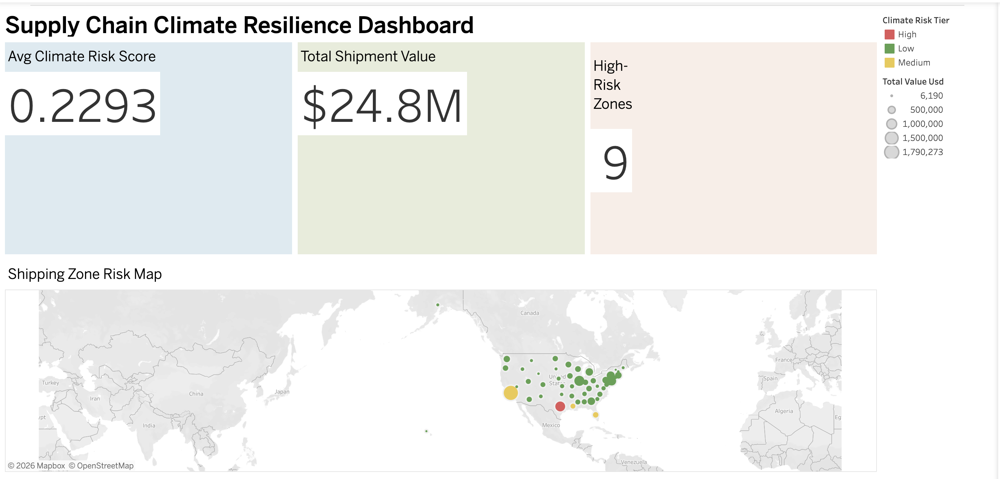
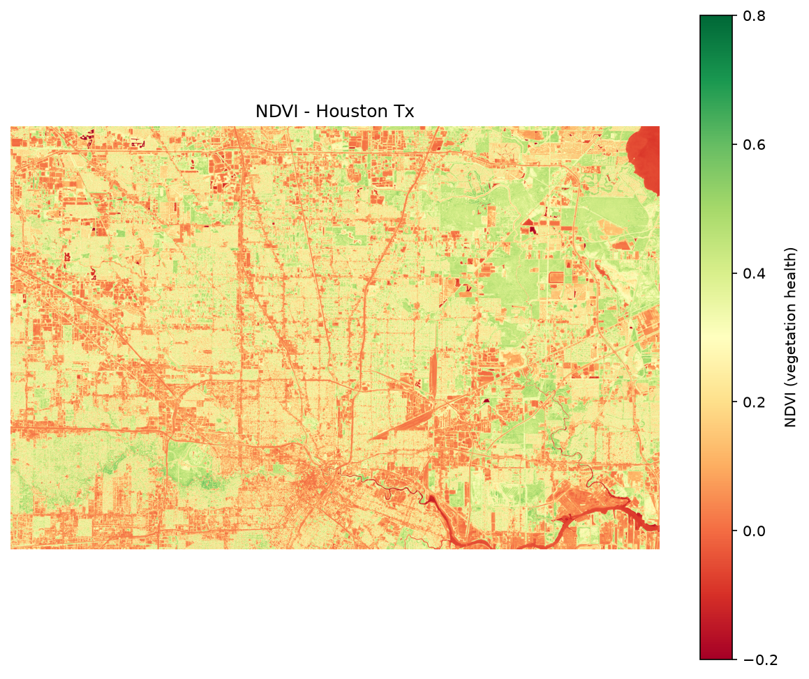
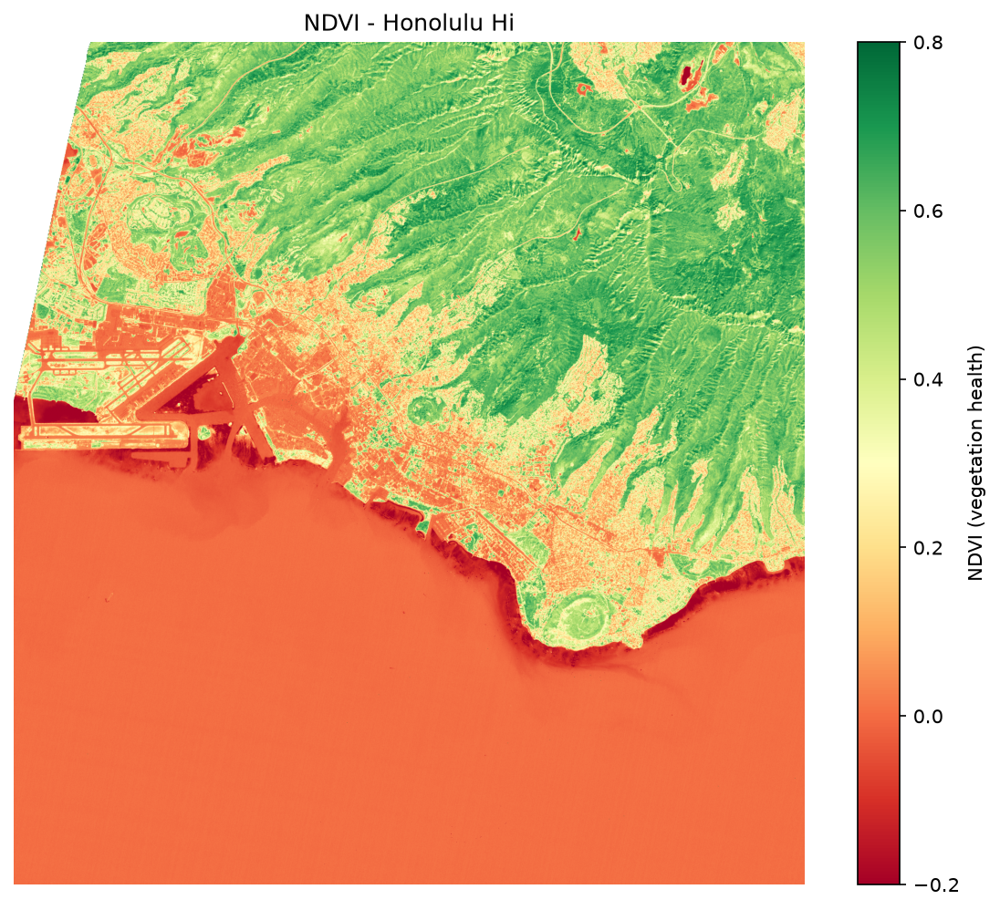
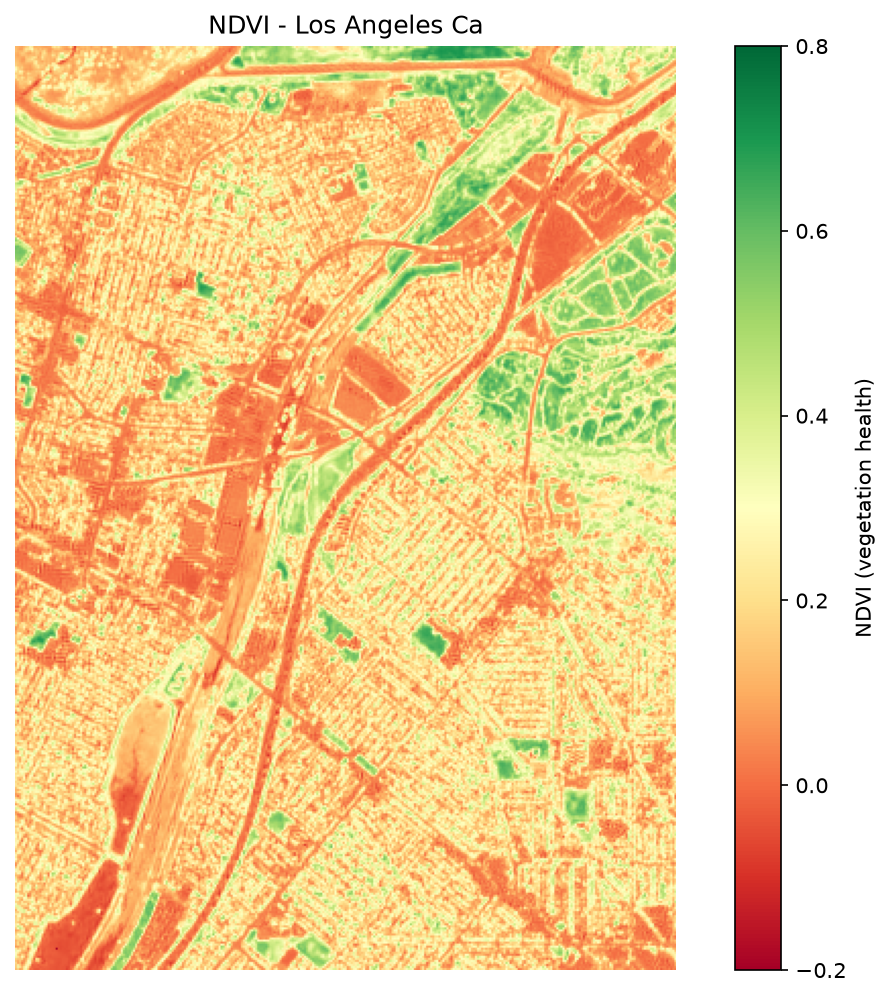
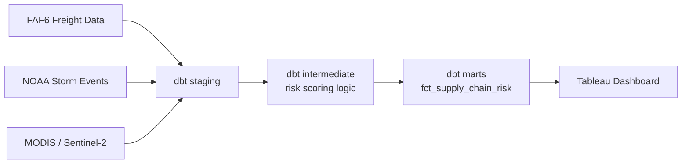
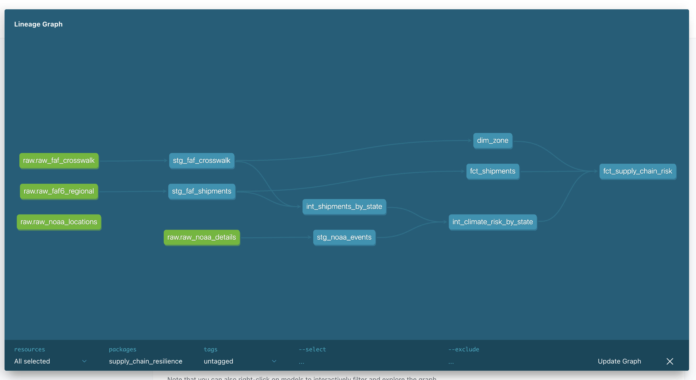

# 🌍 Supply Chain Climate Resilience Dashboard

**Scoring US shipping regions by climate risk — combining freight data, storm history, and real satellite imagery.**

**🔗 [Live Interactive Dashboard](https://public.tableau.com/app/profile/jayana.sarma/viz/Book2_17884678591930/Dashboard1?publish=yes)**

---

## Table of Contents
- [The Problem](#the-problem)
- [Key Findings](#key-findings)
- [What This Project Does](#what-this-project-does)
- [Architecture](#architecture)
- [Tech Stack](#tech-stack)
- [Repo Structure](#repo-structure)
- [Reproducing This Project](#reproducing-this-project)
- [Known Limitations](#known-limitations)
- [Author](#author)

---

## The Problem

Most supply chain monitoring tracks *whether* shipments are late — not *which regions are becoming climate risks before a disruption hits*. This project builds that forward-looking view: combining where freight actually flows with where storms and vegetation stress are concentrated, to flag high-risk, high-value shipping regions before they become a problem.

## Key Findings

**🔴 Texas has the highest absolute climate risk** — the most total storm damage and event count of any state in the dataset. But its satellite-measured vegetation is *healthier* than its own 2020 baseline right now — a reminder that historical exposure and current conditions tell different stories.

**🟡 Hawaii is nearly invisible on a raw damage ranking — but it's the most exposed state relative to its shipping volume.** A simple "biggest total risk" score misses it entirely; adjusting for shipment value surfaces it as genuinely fragile.

**🛰️ Real satellite evidence, not just numbers.** NDVI (vegetation health) computed directly from raw Sentinel-2 band math shows a clear, visible contrast between Houston's river/park corridors and its dense urban core:

| Houston, TX | Honolulu, HI | Los Angeles, CA |
|---|---|---|
|  |  |  |

*Green = healthy vegetation, red = stressed/urban. Computed from raw Sentinel-2 red/NIR band math, not a pre-built index.*

## What This Project Does

- Loads and models US freight flow data (BTS FAF6), 10 years of NOAA storm event records, and satellite vegetation data (MODIS NDVI) across **134 shipping zones**
- Computes **two distinct risk scores** per zone: absolute historical exposure, and risk *intensity* relative to shipping volume
- Adds a hands-on remote sensing layer — real NDVI computed from raw Sentinel-2 bands for 3 case-study metros
- Ships it all in an **interactive Tableau dashboard**

## Architecture

**The actual generated lineage graph** (via `dbt docs`):

9 dbt models · 15 automated data quality tests · full lineage documented via `dbt docs`

## Tech Stack

| Layer | Tools |
|---|---|
| Data pipeline | Python, dbt, DuckDB, SQL |
| Remote sensing | pystac-client, rioxarray, GeoPandas, MODIS, Sentinel-2 |
| Visualization | Tableau |
| Sources | BTS FAF6, NOAA Storm Events, Microsoft Planetary Computer |

## Repo Structure
dbt/ dbt project — staging, intermediate, and mart models + tests
scripts/ Python scripts for pulling satellite data and exporting marts
docs/ Satellite imagery, NDVI maps, dashboard screenshot, lineage graph

## Reproducing This Project

Raw data isn't included in this repo (see `.gitignore`) — download it fresh:

1. **FAF6 freight data:** https://faf.ornl.gov/faf6/data/Download_Files/ZIP/FAF6.0.zip
2. **NOAA Storm Events (2016–2025):** https://www.ncei.noaa.gov/pub/data/swdi/stormevents/csvfiles/
3. Run `scripts/load_raw_data.py` to load everything into DuckDB
4. Run `dbt run` and `dbt test` from `dbt/supply_chain_resilience/`
5. Run `scripts/get_modis_ndvi.py` and `scripts/get_sentinel_ndvi.py` for the satellite layer

## Known Limitations

- Climate risk is modeled at the **state level** (NOAA's granularity), then applied to every FAF zone within that state — not true zone-level precision
- State centroids used for mapping are approximate geographic centers, not zone-specific coordinates

## Author

**Jayana Sarma**
[LinkedIn](https://linkedin.com/in/jayana-sarma)
